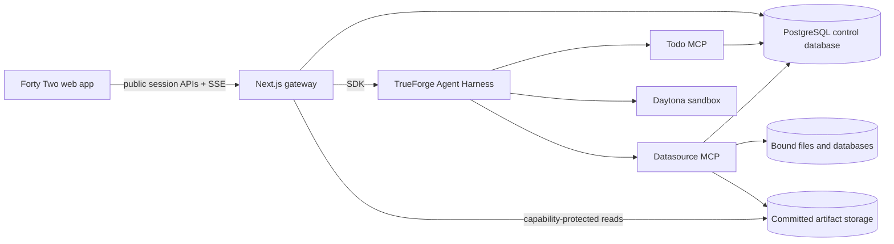

# Forty Two

Forty Two is a conversational analytics workspace built for the TrueForge Agent Harness Hackathon. Connect a file, operational database, or warehouse; open a datasource-bound session; ask a question; and receive a durable answer with inspectable execution, tables, and interactive charts.

The browser talks only to the Forty Two gateway. TrueForge, the datasource MCP service, the Todo MCP service, database credentials, artifact storage credentials, and Daytona control-plane operations remain server-side.

## Product flow

1. Add CSV, Excel, PostgreSQL, MySQL, SQL Server, Snowflake, BigQuery, or Redshift from the connector marketplace.
2. Start a conversation from a ready connector. The session receives an immutable datasource binding.
3. Ask an analytical question. TrueForge runs the registered Forty Two agent and streams normalized public events through the gateway.
4. Follow the visible plan and execution activity. Controlled SQL mutations stop for an explicit, scoped approval.
5. Inspect committed tables and charts. Artifact capabilities are read-only, session-scoped, expiring, and renewable.
6. Reopen the session later. Conversation history, plans, datasource labels, and committed artifacts are durable.

## Architecture



### Why TrueForge matters

- TrueForge owns agent sessions, turns, tool execution, approval continuation, normalized lifecycle events, and Daytona sandbox orchestration.
- The agent uses two authenticated internal MCP servers: one for durable plans and one for session-scoped datasource, SQL, file, table, and chart operations.
- The web application does not impersonate the agent or execute analytical SQL itself. It maps product session IDs to private runtime sessions and presents a redacted, replayable event contract.
- Daytona receives the immutable sandbox image containing the artifact helper. Files move directly from scoped storage into the sandbox; their bytes do not transit the browser or TrueForge message payloads.

## Repository map

| Path                     | Responsibility                                              |
| ------------------------ | ----------------------------------------------------------- |
| `apps/web`               | Product UI, public gateway APIs, SSE, artifact presentation |
| `apps/data-source-mcp`   | Authenticated datasource, SQL, file and artifact MCP tools  |
| `apps/todo-mcp`          | Durable session-plan MCP tools                              |
| `packages/db`            | Database schema, repositories, capabilities and audit state |
| `packages/data-source`   | Connector adapters and SQL safety policy                    |
| `packages/artifacts`     | Canonical table payload and helper contracts                |
| `packages/charting`      | Seven chart renderers and interactive ChartCard             |
| `packages/design-tokens` | Semantic visual tokens and governed fonts                   |
| `packages/ui-web`        | Accessible web primitives                                   |
| `packages/app-shell`     | Responsive application shell                                |
| `docker/trueforge`       | Hosted-mode TrueForge image                                 |
| `docker/sandbox`         | Immutable Daytona analysis image                            |

## Run locally

Requirements:

- Node.js 24 or later
- pnpm 9.15.9
- Docker with Compose
- Azure Blob Storage credentials
- Daytona and OpenAI API credentials
- A published immutable sandbox image digest

Initialize the TrueForge submodule and install dependencies:

```sh
git submodule update --init --recursive
corepack enable
pnpm install --frozen-lockfile
```

Create the environment file:

```sh
cp .env.example .env
```

Set unique values for the required credentials:

```text
POSTGRES_PASSWORD
POSTGRES_READER_PASSWORD
POSTGRES_WRITER_PASSWORD
POSTGRES_MUTATION_PASSWORD
POSTGRES_MCP_PASSWORD
MYSQL_ROOT_PASSWORD
MYSQL_READER_PASSWORD
MYSQL_WRITER_PASSWORD
SQLSERVER_SA_PASSWORD
SQLSERVER_READER_PASSWORD
SQLSERVER_WRITER_PASSWORD
DATA_SOURCE_CREDENTIALS_ENCRYPTION_KEY
MCP_AUTH_TOKEN
MCP_CAPABILITY_SIGNING_KEY
TODO_MCP_AUTH_TOKEN
AZURE_STORAGE_ACCOUNT_NAME
AZURE_STORAGE_ACCOUNT_KEY
AZURE_STORAGE_CONTAINER
DAYTONA_API_KEY
OPENAI_API_KEY
PLATFORM_SANDBOX_IMAGE_URI
```

Every token, key, and password must be independently generated. SQL Server credentials must satisfy its password-complexity policy.

### Publish the Daytona sandbox

Daytona must be able to pull the custom sandbox by immutable digest:

```sh
docker build -f docker/sandbox/Dockerfile -t registry.example.com/forty-two-sandbox:demo .
docker push registry.example.com/forty-two-sandbox:demo
docker buildx imagetools inspect registry.example.com/forty-two-sandbox:demo
```

Set `PLATFORM_SANDBOX_IMAGE_URI` to the resulting `registry/repository@sha256:...` value. Mutable tags are rejected during bootstrap.

### Start the product

```sh
docker compose build
docker compose up -d --force-recreate
docker compose ps
```

Open [http://localhost:3000](http://localhost:3000). The web container runs a prebuilt production Next.js standalone server. TrueForge and both MCP services are internal-only; the public web port is loopback-bound by default.

The default Compose project also includes MySQL and SQL Server containers for
local connector and integration testing. They are not required for a reduced
PostgreSQL-backed product deployment. To start the reduced service set used by
the hosted demo, name the services explicitly:

```sh
docker compose up -d --build \
  postgres database-migrate postgres-readonly-init \
  redis data-source-mcp todo-mcp trueforge trueforge-bootstrap web
```

`trueforge-bootstrap` is a required one-shot service. A healthy `trueforge`
container is not enough: bootstrap must exit successfully before the web
service can serve working sessions. Inspect it with:

```sh
docker compose ps -a trueforge-bootstrap
docker compose logs trueforge-bootstrap
```

The current hosted deployment uses an already-created Daytona snapshot pinned
by its snapshot ID. A fresh Daytona account must successfully create or resolve
the snapshot referenced by `PLATFORM_SANDBOX_IMAGE_URI`; if bootstrap cannot do
that, the deployment is not complete and should not be bypassed by starting the
web container alone.

Stop without deleting persisted data:

```sh
docker compose down
```

## Verification

Fast checks:

```sh
pnpm check-types
pnpm lint
pnpm build
pnpm --filter @repo/design-tokens validate
pnpm --filter @repo/ui-web test
pnpm --filter @repo/charting test
pnpm --filter web test:chat-client
pnpm --filter web test:turn-events
pnpm --filter web test:chat-backend
pnpm --filter web test:artifacts
pnpm --filter @forty-two/data-source-mcp test
```

Live stack checks:

```sh
pnpm test:control-plane-isolation
pnpm test:platform-integration
pnpm test:chat-backend-e2e
pnpm test:frontend-client
pnpm test:plan-e2e
pnpm test:artifact-backend-e2e
pnpm test:sql-change-approval-e2e
```

The live suites verify datasource isolation, browser contract replay, plans, approvals, committed artifact integrity, cleanup, and revocation. Credential-gated warehouse checks require their provider credentials.

## Security boundaries

- Public requests cannot provide raw AgentSpecs, internal connector names, runtime IDs, MCP service tokens, SQL approval arguments, or storage credentials.
- Sessions bind only ready datasource IDs and cannot change bindings after creation.
- Datasource MCP tools validate both service authentication and the active session binding.
- Read queries and controlled mutations have separate tools and policies. Applying a mutation requires matching TrueForge approval provenance.
- Browser artifact capabilities cannot call MCP tools or control-plane APIs.
- TrueForge and the MCP services have no host-published ports.
- Database ports are loopback-only and exist for local connector verification.

## Qodo Code Review Evidence

The implementation stack through PR #14 was submitted through Qodo-reviewed
pull requests. The review threads, findings, remediation commits, and follow-up
reviews remain attached to those PRs.

- Backend foundation: [PR #2](https://github.com/pawxnsingh/forty-two/pull/2) through [PR #11](https://github.com/pawxnsingh/forty-two/pull/11)
- Interface and connectors: [PR #12](https://github.com/pawxnsingh/forty-two/pull/12)
- Conversational analytics and visualization: [PR #13](https://github.com/pawxnsingh/forty-two/pull/13)
- Production and submission readiness: [PR #14](https://github.com/pawxnsingh/forty-two/pull/14)

Qodo review was requested with `/agentic_review` on those PRs and rerun after
remediation. Commits made directly on `main` after PR #14 are not covered by the
PR evidence above; consult the current Git history when evaluating exact-revision
review coverage.

## Demo

- Live product: [https://agentharness.duckdns.org](https://agentharness.duckdns.org)
- Demo video: pending publication

Recommended judge flow:

1. Open Connectors and add the provided PostgreSQL or CSV demo datasource.
2. Use **Start conversation** from the connector menu.
3. Ask for a grouped summary and an interactive chart.
4. Expand execution activity, inspect the plan, switch between chart and table, and open fullscreen.
5. Ask a follow-up to demonstrate durable datasource context.
6. Reload the page to demonstrate session, plan, and artifact restoration.
7. Demonstrate a controlled SQL change and deny or approve it from the scoped approval card.

Replace the pending demo-video entry with the final public recording before the
submission form is sent.

## AI-assisted development disclosure

This hackathon project was developed with AI coding agents for planning, implementation, testing, review remediation, and documentation. Qodo supplied continuous pull-request review. Product runtime analysis is performed by the TrueForge-managed Forty Two agent using the authenticated MCP and Daytona environment described above.
